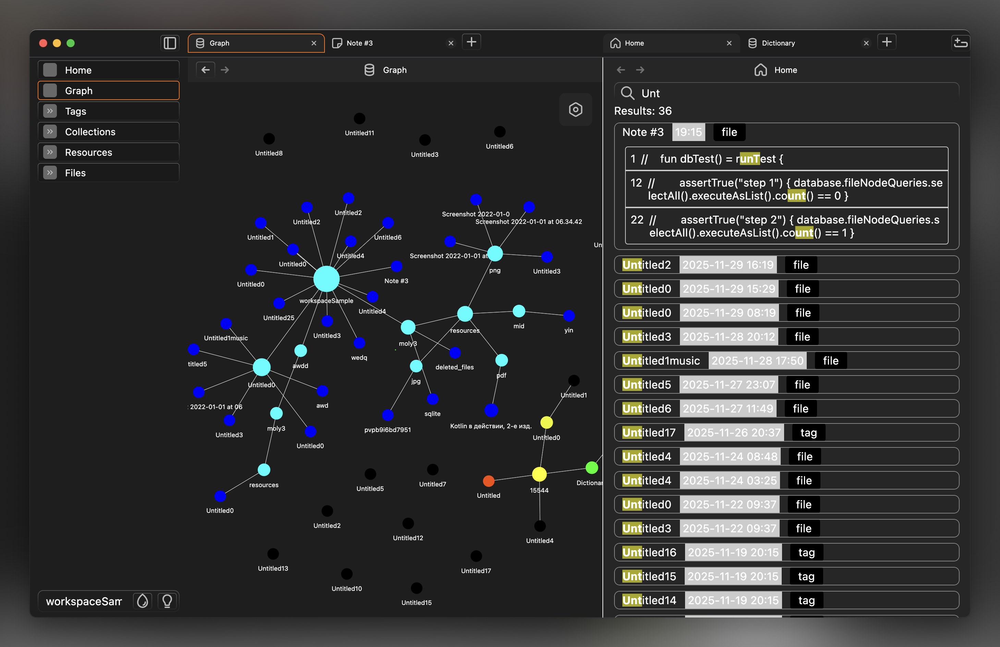
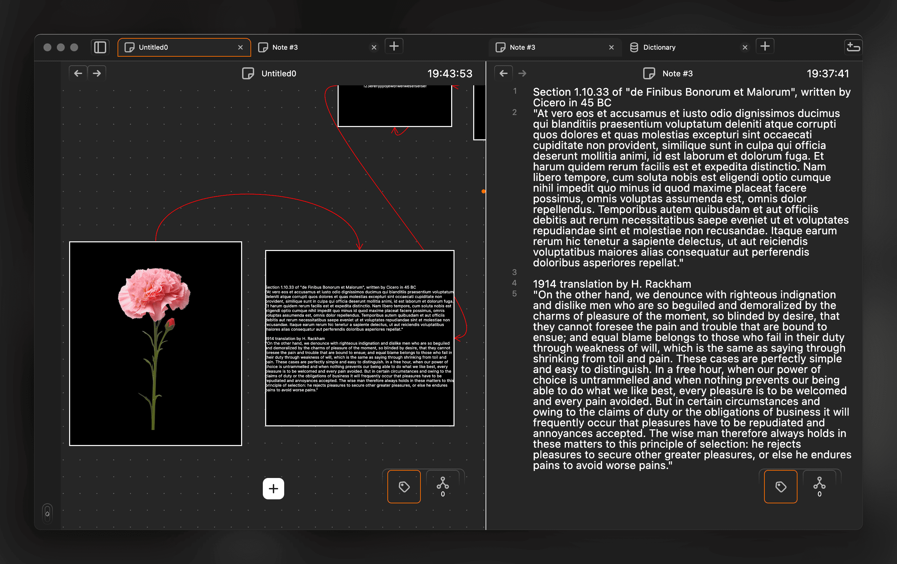
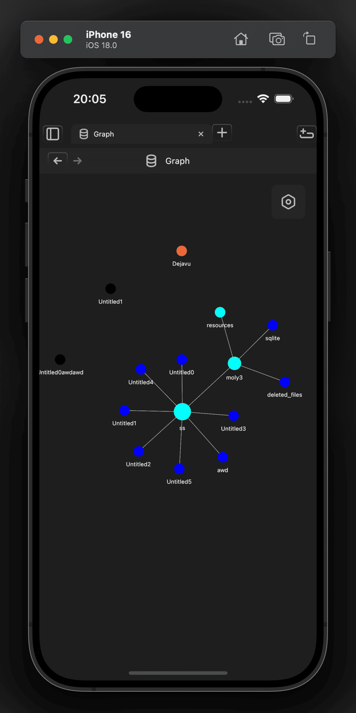

<header>
  

    
  

   
    

![badge][badge-jvm]
(
![badge][badge-mac]
![badge][badge-windows]
![badge][badge-linux]
)
![badge][badge-android]
![badge][badge-ios]
(demo ![badge][badge-wasm])

  

  <h1 align="center">CedarJam</h1>

**Note-Taking App**. Local storage. An app for creating only useful data and autogenerating visual-links between your data. Showing how much Compose Multiplatform can do!

> Cedar jam is made from small cedar cones simmered with sugar or honey.  
> Definitely, you should try!

![badge][badge-wasm] demo, less features & not ready for production: https://cedarjamdemo.3moly.com/

</header>

    
      
          
         

## Pitfalls

- **No community plugins.** Maybe in the future — if anything like the Minecraft mod ecosystem becomes possible (likely on ![badge][badge-jvm]).
- **![badge][badge-wasm] is demo-only.** Browsers don’t provide a real file/folder structure, which limits full functionality.
- **No Sync for now. But sync is possible to implement, but needs research.** Real-time updates between devices were successful (tablet ↔ desktop), but proper data persistence still requires better design.
- **No Markdown editor support.** Compose currently has challenges with efficient rendering of inline blocks. Existing open-source solutions show performance trade-offs that need further evaluation.
- UI might look strange. Working on this.

---

> And this project is great for thinking in a way of what user want and what Compose/Kotlin can give.

# Advantages

### Saving state and opened pages
![badge][badge-mac]
![badge][badge-windows]
![badge][badge-linux]
![badge][badge-android]
![badge][badge-ios]

App can save all saveable states and 100% of navigation tree. So open the app, open pages, do staff and close the app. And by returning, you'll see the same state, the same opened tabs, pages. 

We've checked many popular apps, for example graph nodes are always give random positions by returning, and you need to search these nodes and drag nodes to their positions again. But CedarJam saves positions of these nodes, and you might think that app didn't closed!

## Features

### Multi Tabs
![badge][badge-mac]
![badge][badge-windows]
![badge][badge-linux]
![badge][badge-android]
![badge][badge-ios]
![badge][badge-wasm]

### Canvas/Whiteboard
![badge][badge-mac]
![badge][badge-windows]
![badge][badge-linux]
![badge][badge-android]
![badge][badge-ios]
![badge][badge-wasm]

### Graph nodes
![badge][badge-mac]
![badge][badge-windows]
![badge][badge-linux]
![badge][badge-android]
![badge][badge-ios]
![badge][badge-wasm]

### PDF View
![badge][badge-mac]
![badge][badge-windows]
![badge][badge-linux]
(planned to add 
![badge][badge-android]
![badge][badge-ios])

### Opened File reveal in App File Tree
![badge][badge-mac]
![badge][badge-windows]
![badge][badge-linux]
![badge][badge-android]
![badge][badge-ios]
![badge][badge-wasm]

### .MID notes Quiz by using real MIDI (WIP)
![badge][badge-mac]
![badge][badge-windows]
![badge][badge-linux]

### Anki integration in desktop using 3rd party sources (WIP)
![badge][badge-mac]
![badge][badge-windows]
![badge][badge-linux]

# Core libraries

|  |  |
|------|--------------|
| UI | [Compose Multiplatform](https://github.com/JetBrains/compose-multiplatform) |
| Database | [SQLDelight](https://github.com/cashapp/sqldelight) |
| Navigation | [Decompose](https://github.com/arkivanov/Decompose) |
| MVI | [MVIKotlin](https://github.com/arkivanov/MVIKotlin) |
| Save State | [Essenty](https://github.com/arkivanov/Essenty) |
| DI | [Koin](https://github.com/InsertKoinIO/koin) |

# Other libraries

|  |  |
|------|--------------|
| Whiteboard/Canvas | [compose-data-viz](https://github.com/3moly/compose-data-viz) |
| Graph nodes | [compose-data-viz](https://github.com/3moly/compose-data-viz) |
| Images | [Coil](https://github.com/coil-kt/coil) |
| VideoPlayer | [ComposeMediaPlayer](https://github.com/kdroidFilter/ComposeMediaPlayer) |
| etc. | [toml](gradle/libs.versions.toml) |

### Project's Structure
[Mermaid Diagram.md](docs/projectStructure.md)

[badge-android]: http://img.shields.io/badge/-android-6EDB8D.svg?style=flat
[badge-jvm]: http://img.shields.io/badge/-jvm-DB413D.svg?style=flat
[badge-linux]: http://img.shields.io/badge/-linux-2D3F6C.svg?style=flat 
[badge-windows]: http://img.shields.io/badge/-windows-4D76CD.svg?style=flat
[badge-wasm]: https://img.shields.io/badge/-wasm-624FE8.svg?style=flat
[badge-ios]: http://img.shields.io/badge/-ios-CDCDCD.svg?style=flat
[badge-mac]: http://img.shields.io/badge/-macos-111111.svg?style=flat

`./gradlew :shared:hotRunJvm --autoReload`